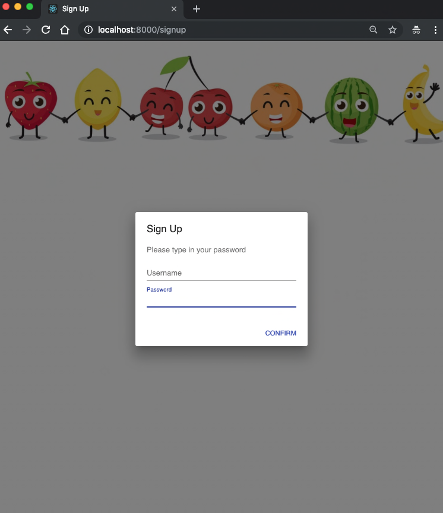
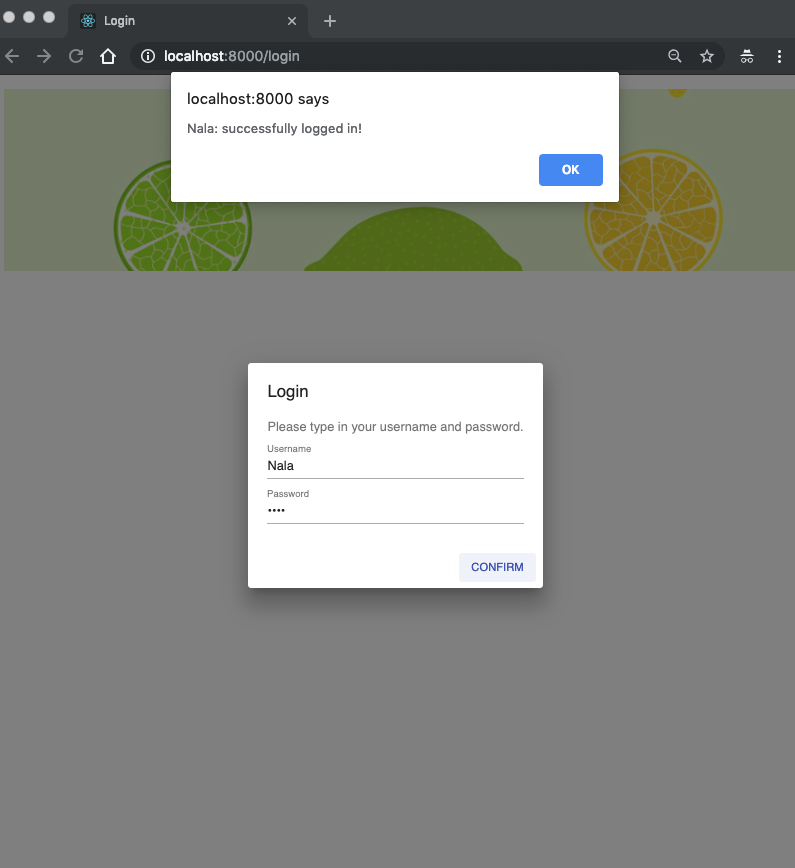
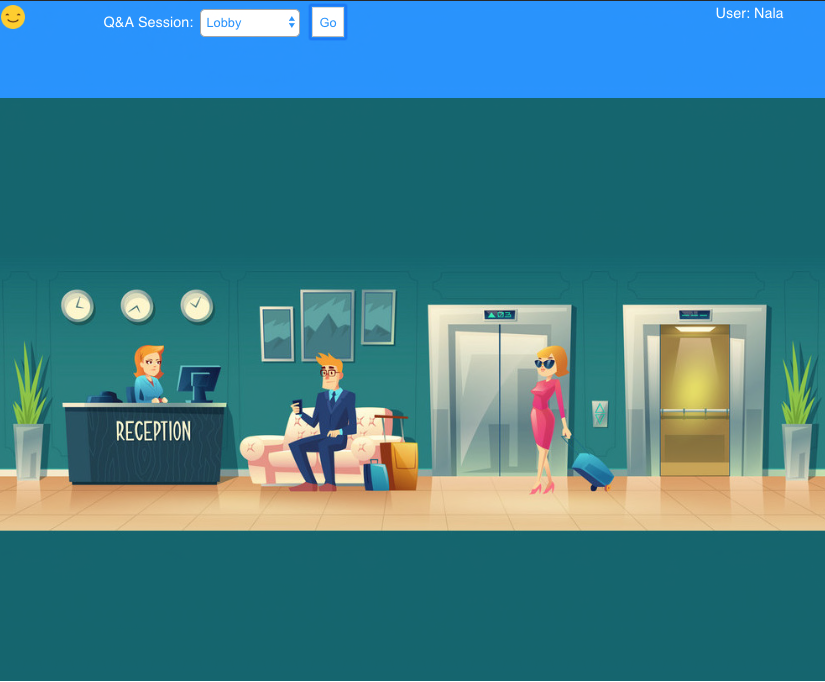
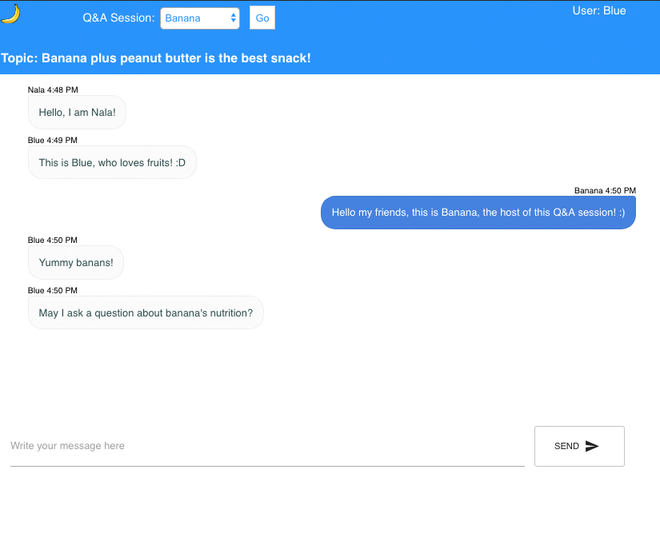

# About Live Q&A App, by Slice Inc (Output)

## How to start the app

Run the scripts in package.json file.

## Technologies used

- Front end: React, socket.io-client, material-ui, livechat-ui
- Backend: Node.js, Express.js, socket.io
- DB: MongoDB, Mongoose
- Bundle: Webpack, Babel

## Screenshots of the app

1. Signup page
2. Login page
3. Lobby for all Q&A sessions
4. An ongoing Q&A session, Banana

# Web Developer Worktest - App's Requirements (Input)

**Setup**

1. Install NPM and Node.js v5.6.0 or later. Refer to <https://nodejs.org> for instructions.
2. Run "npm install".
3. Launch the server via "npm start". The server will run on <http://localhost:8081> by default.

**Instructions**

Imagine you work for the fruit Q&A company Slice, Inc. You and your partner, Jim, were put in
charge of building the page on the company's public website that allows users to view live Q&A sessions.

Jim was put in charge of implementing the look, interaction, and functionality of the two pages
based off of the "worktest-desktop.png" and "worktest-mobile.png" mocks.

Unfortunately for you, Jim is a lazy and incompetent web developer. As you can see from the code in this package,
he didn't get very far in his work, so it's now up to you to finish what he started.

**Restrictions**

- There are no restrictions on any libraries or frameworks you choose to include.

- We expect a single solution that can automatically handle rendering both desktop and mobile views.

- The data must be populated from the server APIs described below.

- There are no limitations on browser support, use the latest and greatest technology.
  However, you will be expected to know the browser compatibility of any code you write.

- We do not expect pixel perfection in this exercise, use your best estimates for font sizes, colors, distances, etc.

**Other info**

All files under "public" can be referenced directly from the server under "/".
For example, "public/assets/apple.png" can be accessed via "<http://localhost:8081/assets/apple.png>".

All necessary assets can be found in the public/assets directory.

Use the following APIs to retrieve necessary data in JSON format:

    GET /api/qa     ->  returns a list of all Q&A sessions

    GET /api/qa/:id ->  returns the model for a specific Q&A session

When you are finished, please provide us a link to your GitHub with your solution or email it directly to <jim@jobox.ai>.

Let us know if you have any questions!
